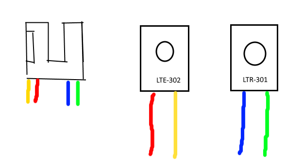

FOR NON-COMMERCIAL USE. EMAIL ME (pollardzane@gmail.com) IF YOU DO REPAIRS PROFESSIONALLY AND I WILL SELL YOU SOME OR LICENSE THEM TO YOU. 

This is an STL for the housing of an optosensor/pickoff of the sonar models of sx-70/680/690 cameras.

This print requires two components. The LTR-301 phototransistor and the LTE-302 IR emitter. The LTE-302 goes in the slot that has the flanges at the side and the LTR-301 goes in the side with the small opening hole in the center of the part.

